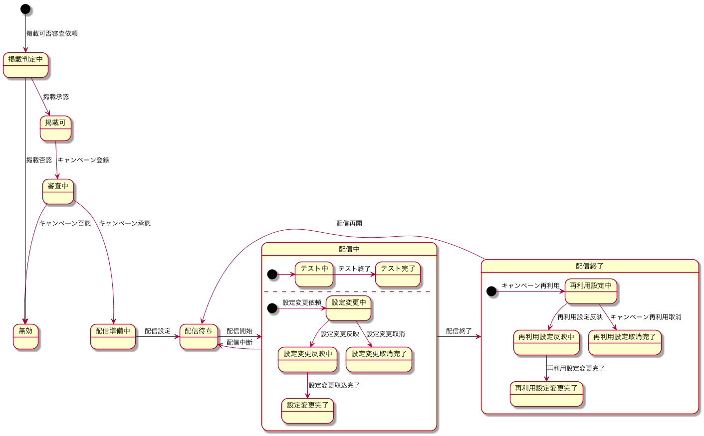

# State

状態遷移

## キャンペーン

### 状態一覧

| シンボル | 意味 |
| -------- | ---- |
| judge | 掲載判定中 |
| pass | 掲載可 |
| invalid | 無効 |
| review | 審査中 |
| prepare | 配信準備中 |
| ready | 配信準備完了 |
| delivery | 配信中 |
| close | 配信終了 |

| ready | 配信待ち |
| editing | 変更中 |
| reflecting | 反映中 |

### 状態遷移図

