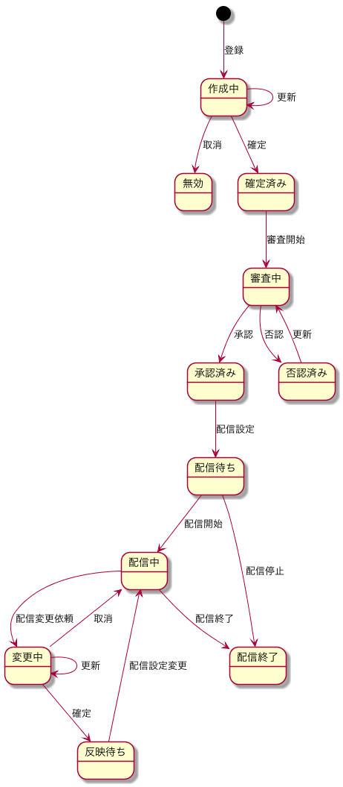

# State

状態遷移

## キャンペーン

### 状態一覧

| シンボル | 意味 |
| -------- | ---- |
| in_judge | 掲載可否判定中 |
| pass | 掲載OK |
| invalid | 掲載NG |
| review | 審査中 |
| prepare | 設定中 |
| ready | 設定完了 |
| test | テスト中 |
| setup | 本番設定中 |
| delivery | 配信中 |
| close | 配信終了 |
| ready | 配信待ち |
| edit | 設定変更中 |
| reflect | 設定変更反映中 |
| reuse | 設定再利用中 |

### 状態遷移図

