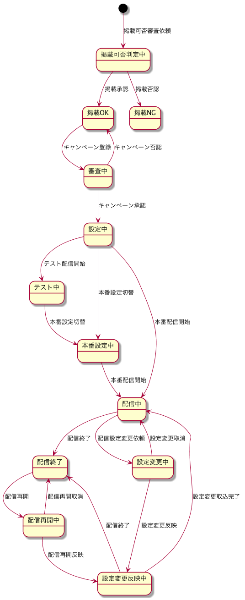

# State

状態遷移

## キャンペーン

### 状態一覧

| シンボル | 意味 |
| -------- | ---- |
| judging | 掲載可否判定中 |
| passed | 掲載OK |
| disapproved | 掲載NG |
| checking | 審査中 |
| setting | 設定中 |
| configured | 設定完了 |
| testing | テスト中 |
| preparing | 本番設定中 |
| working | 配信中 |
| closed | 配信終了 |
| editing | 設定変更中 |
| changing | 設定変更反映中 |
| reusing | 設定再利用中 |

### 状態遷移図

